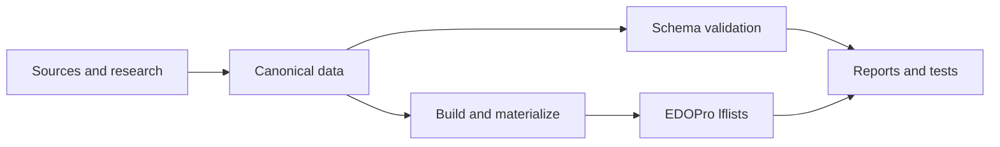

<div align="center">

<h1>edopro-retro-formats</h1>

<p><strong>Historical Yu-Gi-Oh! formats, rebuilt from evidence.</strong></p>

<p>Source-backed, reproducible format data and EDOPro assets for the eras worth preserving.</p>

<p>
  <a href="https://github.com/cntrl-alt-lenny/edopro-retro-formats/actions/workflows/ci.yml"></a>
  <a href="https://www.python.org/"></a>
  <a href="LICENSE"></a>
  <a href="#project-status"></a>
</p>

<p><em>Accuracy before breadth.</em></p>

<p>
  <a href="#quick-start">Quick start</a> ·
  <a href="#current-formats">Current formats</a> ·
  <a href="#how-it-works">How it works</a> ·
  <a href="#documentation">Documentation</a> ·
  <a href="#contributing">Contributing</a>
</p>

</div>

> [!IMPORTANT]
> This is an accuracy-first preservation project. GOAT, Edison, and Tengu are the current canonical formats. The 1999 Tokyo Dome work is a research gate only; no canonical Tokyo Dome format has been created.

## What this is

`edopro-retro-formats` turns historical format research into validated, reproducible data:

```text
sources + dated evidence
          ↓
canonical formats, pools, banlists, rule profiles, and errata
          ↓
validated EDOPro lflists and reports
```

The project exists for formats whose identity depends on more than a single banlist. A trustworthy reconstruction may also need release chronology, card versions, historical rulings, engine behaviour, territory, and a clear record of what is still unknown.

### Project status

| Layer | Current state |
| --- | --- |
| Canonical formats | **3** — GOAT, Edison, and Tengu |
| Historical errata | **296 records**, all V2 |
| Card pools | Extensional lists and release-cutoff definitions |
| EDOPro output | Generated lflists under [`dist/`](dist/) |
| Runtime | Python 3.10+, standard library only |
| Quality bar | Validation, reproducible builds, regression tests, and source-linked research |

## Current formats

The repository currently ships three canonical, end-to-end format records. Their notes explain the evidence and remaining limitations in more depth.

| Format | Snapshot | Pool | Rule / research status | Reference |
| --- | --- | ---: | --- | --- |
| **GOAT** | April 2005 | 1,700 cards | Reproduces the Project Ignis GOAT implementation | [`formats/2005-04-goat/`](formats/2005-04-goat/) |
| **Edison** | 24 April 2010 | 3,673 cards | Custom MR1-era profile; historical errata are computed | [`formats/2010-03-edison/`](formats/2010-03-edison/) |
| **Tengu** | 17 September 2011 | 4,562 cards | Custom MR2-era profile; historical errata are computed | [`formats/2011-09-tengu/`](formats/2011-09-tengu/) |

The generated outputs are regression-tested against their canonical inputs. GOAT preserves the deduplicated EDOPro content hash `0x28e9fc02`; Tengu preserves `0x0ce5babe`.

The next major research direction is [`1999-08-tokyo-dome`](docs/research/yugi-kaiba-format-source-gate.md). It remains blocked from canonicalization while its event rules, banlist, card-pool boundary, and engine representability are being established.

## Quick start

Clone the repository, then run the same checks used by CI:

```bash
python3 -m retroformats validate
python3 -m retroformats build
python3 -m retroformats build --check
python3 -m retroformats report
python3 -m unittest discover -t . -s tests -v
```

On Windows, use `python` or the Python launcher (`py -3`) in place of `python3` if that is how Python is installed on your machine.

Useful commands:

```bash
# Show the current format and errata accounting in more detail
python3 -m retroformats report -v

# Re-materialize release-cutoff pools after changing release data
python3 -m retroformats materialize
```

`build` writes generated EDOPro assets. `build --check` is the clean-tree guard: it fails if generated output is out of sync with canonical data.

## Why the model is different

### Evidence is part of the data

Sources are not an afterthought. Format records, pool rules, errata chronology, and card identities carry provenance so a future maintainer can inspect why a value exists.

### Uncertainty stays visible

If a historical transition cannot be dated, the repository records the ambiguity and applies an explicit policy where one is justified. It does not silently turn an unresolved question into a fact.

### Pools are reproducible

A format can use an exact extensional pool or a release-cutoff rule. Release-based pools are materialized from dated product and printing data, with coverage and exclusions checked by the validator.

### EDOPro is an output target, not the source of truth

The project generates EDOPro-compatible lflists, but keeps historical identity, legality, chronology, and rule research in version-controlled source data. That separation makes the result reviewable and regenerable.

## How it works



The core pipeline is deliberately small:

1. Define a format and its snapshot.
2. Select the historical banlist, pool, rule profile, and errata policy.
3. Validate references, schemas, chronology, and coverage.
4. Build deterministic EDOPro output.
5. Compare the result with tests, hashes, and human-readable reports.

See [the architecture guide](docs/architecture.md) for the full data flow and [the format schema guide](docs/format-schema.md) for the record model.

## EDOPro integration

Generated lflists use a closed whitelist where appropriate: cards outside the historical pool are rejected even when they are legal under the banlist. Historical implementations are selected through the errata model, while rule profiles map the period's behaviour to the capabilities of the pinned ocgcore/client.

For integration details, see [EDOPro research](docs/edopro-research.md), [ocgcore flags](docs/research/ocgcore-flags.md), and [engine testing](docs/engine-testing.md).

## Repository map

| Path | Purpose |
| --- | --- |
| [`formats/`](formats/) | Canonical format records and format-specific notes |
| [`data/banlists/`](data/banlists/) | Historical Forbidden/Limited list snapshots |
| [`data/pools/`](data/pools/) | Exact pools and release-cutoff pool definitions |
| [`data/rule-profiles/`](data/rule-profiles/) | Engine-facing historical rule profiles |
| [`data/errata/`](data/errata/) | The versioned historical errata corpus |
| [`data/releases/`](data/releases/) | Product, printing, territory, and release chronology |
| [`schemas/`](schemas/) | JSON Schemas for canonical data |
| [`retroformats/`](retroformats/) | Validator, builder, importers, and reporting tools |
| [`tests/`](tests/) | Unit, integration, regression, and research-gate tests |
| [`docs/`](docs/) | Architecture, methodology, research, and contributor guidance |
| [`dist/`](dist/) | Generated EDOPro assets; never hand-edit |

## Documentation

The most useful paths through the repository are:

| If you want to… | Start here |
| --- | --- |
| Understand the project | [Roadmap](docs/roadmap.md) · [Architecture](docs/architecture.md) |
| Add or audit a format | [Format schema](docs/format-schema.md) · [Data sources](docs/data-sources.md) |
| Understand card-version selection | [Errata guide](docs/errata.md) · [Erratum V2 state model](docs/research/erratum-state-model-v2.md) |
| Inspect a canonical format | [GOAT notes](formats/2005-04-goat/notes.md) · [Edison notes](formats/2010-03-edison/notes.md) · [Tengu notes](formats/2011-09-tengu/notes.md) |
| Follow current research | [Tokyo Dome source gate](docs/research/yugi-kaiba-format-source-gate.md) · [Edison rules](docs/research/edison-rules.md) · [Tengu source gate](docs/research/tengu-format-source-gate.md) |
| Work on engine fidelity | [EDOPro research](docs/edopro-research.md) · [Engine testing](docs/engine-testing.md) |

The repository's `docs/` directory is the source of truth for historical claims. Keeping research beside schemas, data, and tests means an evidence change can be reviewed together with the code that verifies it.

## Contributing

Research and implementation improvements are welcome. A useful contribution usually follows this shape:

1. Add or improve a source record, with a direct citation and an explanation of scope.
2. Update the smallest canonical data set that the evidence actually supports.
3. Add or update tests so the important identity, count, hash, or coverage claim is mechanically frozen.
4. Run validation, build checks, reports, and the full test suite.
5. Explain unresolved questions instead of filling them with assumptions.

Before opening a pull request, please include the commands run and call out any intentionally unchanged generated output. For historical research, distinguish primary evidence, later transcriptions, strong secondary reconstructions, community convention, and inference.

## What this project is not

- It is not an official Konami rules archive or ruling authority.
- It is not a fork of EDOPro or a replacement for Project Ignis.
- It is not a promise that every historical format can be represented exactly by the current engine.
- It is not “complete” merely because a generated file builds: provenance, coverage, and uncertainty still matter.

## License

Code and original documentation are released under the [MIT License](LICENSE). Card names, card text, and game data remain the property of their respective owners; source attribution is maintained in [`data/sources.json`](data/sources.json) and the relevant format/research records.
