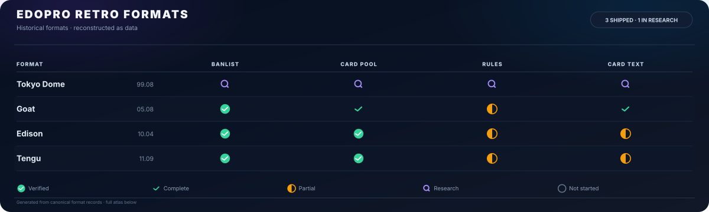
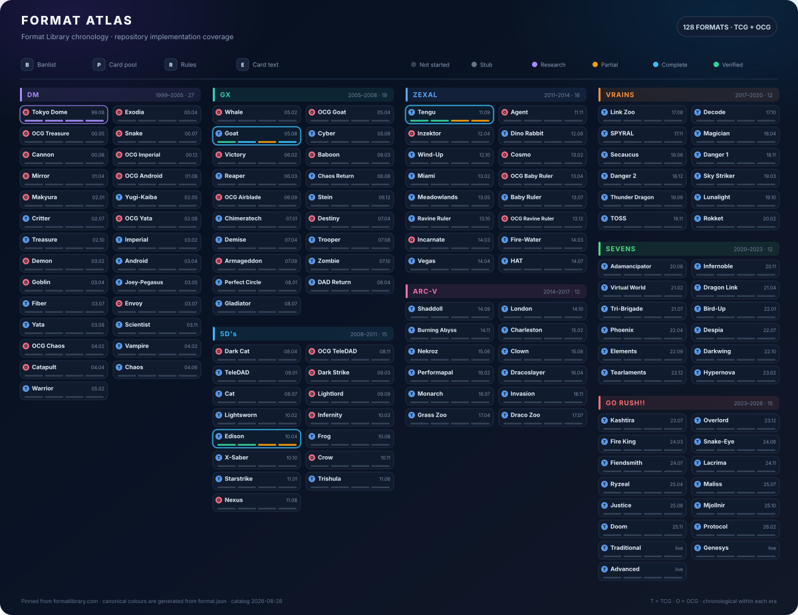

<div align="center">

<h1>edopro-retro-formats</h1>

<p><strong>Historical Yu-Gi-Oh! formats, reconstructed as data.</strong></p>

<p>
  <a href="https://github.com/cntrl-alt-lenny/edopro-retro-formats/actions/workflows/ci.yml"></a>
  <a href="https://www.python.org/"></a>
  <a href="LICENSE"></a>
</p>

<p>Canonical sources in. Validated EDOPro assets out.</p>

</div>

<p align="center">
  <a href="https://github.com/cntrl-alt-lenny/edopro-retro-formats/raw/refs/heads/main/docs/assets/format-banner.svg" target="_blank" rel="noopener" title="Open the full-size format banner">
    
  </a>
</p>

<p align="center"><sub>Click the banner to open the full-size SVG. It is generated from a pinned <a href="https://formatlibrary.com/formats/">Format Library</a> catalog and this repository's canonical status data.</sub></p>

## The project

Historical formats are more than banlists. They also depend on card pools, release territory, period rules, old card behaviour, and the evidence behind every decision.

This repository models those pieces separately, validates how they fit together, and builds deterministic assets for [EDOPro](https://github.com/edo9300/edopro). Shared research is reused across eras; uncertainty is recorded rather than guessed.

```text
sources → canonical data → validation → EDOPro output
```

## Quick start

Python 3.10+ is the only requirement.

```bash
python3 -m retroformats validate
python3 -m retroformats build
python3 -m retroformats report
python3 -m unittest discover -t . -s tests -v
```

On Windows, use `python` or `py -3` if `python3` is not available.

Generated lflists live in [`dist/lflists/`](dist/lflists/). Run `python3 -m retroformats build --check` to verify that committed output still matches its canonical inputs.

## Explore

- [Architecture](docs/architecture.md) — how sources become reproducible format assets
- [Format model](docs/format-schema.md) — the canonical record tying each format together
- [Historical errata](docs/errata.md) — selecting period-correct card implementations
- [Release data](docs/releases.md) — deriving pools from products, dates, and territories
- [Engine research](docs/edopro-research.md) — mapping historical rules onto EDOPro and ocgcore
- [Roadmap](docs/roadmap.md) — research direction and open work

<details>
<summary><strong>View the detailed format atlas</strong></summary>

<p align="center">
  <a href="https://github.com/cntrl-alt-lenny/edopro-retro-formats/raw/refs/heads/main/docs/assets/format-atlas.svg" target="_blank" rel="noopener" title="Open the full-size detailed format atlas">
    
  </a>
</p>

<p align="center"><sub><a href="https://github.com/cntrl-alt-lenny/edopro-retro-formats/raw/refs/heads/main/docs/assets/format-atlas.svg">Open the full-size detailed atlas</a>.</sub></p>

</details>

## Principles

- **Evidence before confidence.** Claims carry provenance; unknowns remain unknown.
- **Data before hand-maintained output.** Generated files are reproducible and checked in CI.
- **Shared foundations.** Banlists, pools, rules, releases, and errata can serve many formats.
- **Accuracy before breadth.** A format earns its status one verified layer at a time.

<details>
<summary><strong>Maintaining the format atlas</strong></summary>

The atlas is not hand-coloured. Canonical progress is read from each format's `implementation_status`; research-only progress is explicit in [`docs/format-atlas-progress.json`](docs/format-atlas-progress.json).

```bash
# Refresh the pinned Format Library catalog and regenerate the SVG
python3 scripts/generate_format_atlas.py --refresh

# Confirm the checked-in atlas is current with repository data
python3 scripts/generate_format_atlas.py --check
```

</details>

## License

Code and original documentation are available under the [MIT License](LICENSE). Yu-Gi-Oh! card names, text, and game data remain the property of their respective owners.
